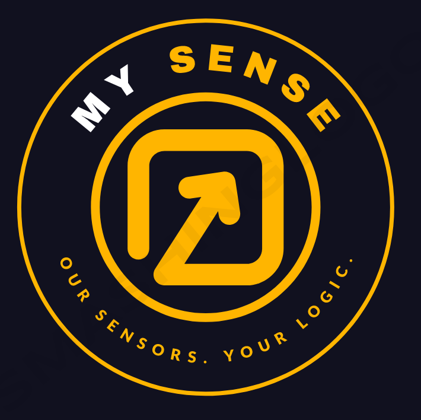

# As-Is Solution
In order to understand the migration of a product we must start from the product itself. In this section I am going to analyze the current state of art of the company and the product they want to elevate to Cloud environment, choosing Microsoft Azure as provider.

## MySense

* Small size (< 50 employees) company that has developed an IoT solution called SensoLogic
* The CTO, Daniel Robinson, has heard that going into the Cloud can have multiple benefits and he is asking us to explain them, motivating the choice
* The Delivery Team Leader, Michael Griffin, need to be taught the technical and pratical ways to work on Azure and how this new knowledge will impact his team

## SensoLogic
* SensoLogic is a solution that integrates several IoT devices into a customizable platform
* SensoLogic is a software that must be installed on a local machine, connected to internet or to a local network reachable by the sensor data
* SensoLogic is not multi-tenant, every customer has its own copy of the software installed on its machine

### Architecture
In the following the schema of the solution. The product is split in few components, it is quite monolytic.

* The sensors (SensorA, SensorB and SensorC) are several type of devices both produced by MySens or integrated into the solution. The belong to different families and they communicate with the platfrom in different ways.
* **Gatherer** is a monolythic Windows Service, installed on the customer local machine, which job is to communicate directly with the sensors. Because sensors have got different ways of communicating and "speak" different languages, Gatherer can orchestrate the communication and the translation on a single data model.
* **Processor** receives the messages of sensors translated by Gatherer and elaborates them. The output of the elaboration of a single message is written on the database
* **API** are the main interface to connection to the MySQL database that contains ALL the persistent data
* The **WebApp** is the GUI of seeing the data received, watching dashboards of analytics and configuration of the whole architecture
* The **MySQL Database** contains all the persistent data

### Message flow
1. The messages are received on Gatherer machine in different ways (TCP socket, UDP push, MQTT...). The message is translated from sensor language and protocol to a json common data model
2. The translated message are sent to Processor via MQTT
3. The message is elaborated and the output written on database via API
4. The result can be seen with a dashboard on the GUI of WebApp

### Configuration
* The configuration parameters of the services, describing which kind of work must be done on the data, which treshold, alarms to thrown eccetera, are stored in a *settings* table on the database
* The only configuration of the service outside the database is stored on an XML file that contains the url and authentication credentials (encrypted) to reach the correct API endpoint

### Installation
All the services are installed manually via a powershell script that Michael Griffin has worked months upon. It is used to extract the content of a zip folder to a specific folder in the server of the customer, creates the Windows Service commands and install API on the IIS, that must be firstly manually activated on the machine. 

The current installation and configuration of a customer still requires 4 hours of manual work. It is not dramatic, but can become hard to mantain with the number of customers that are going to buy the system in the next months.
